# Kibana Dashboard
An importable kibana dashboard to use that's compatible with our filebeat setup. Built in Kibana 7.8 but should be compatible with other versions too, especially 7.x versions.

### Table of Contents
- [Overview](#Overview)
- [Setup](#setup)
  * [Import the Dashboard](#import-the-dashboard)
    + [Option A: Elasticsearch REST API (recommended)](#option-a-elasticsearch-rest-api-recommended)
    + [Option B: Kibana GUI](#option-b-kibana-gui)
      - [Step B.1: Open the Stack Management Settings view](#step-b1-open-the-stack-management-settings-view)
      - [Step B.2: Open Saved objects view](#step-b2-open-saved-objects-view)
      - [Step B.3: Upload the file](#step-b3-upload-the-file)
      - [Step B.4: Open the Dashboard](#step-b4-open-the-dashboard)
      - [Step B.5: Change the Time Filter](#step-b5-change-the-time-filter)
- [Interpreting the pre-defined visualizations](#interpreting-the-pre-defined-visualizations)
    + [Charts we provide](#charts-we-provide)
    + [Default Filters](#default-filters)
  * [Interacting with the Dashboard](#interacting-with-the-dashboard)
  * [Use our Pre-defined Queries](#use-our-pre-defined-queries)
  * [Other Queries to Consider](#other-queries-to-consider)
  * [Further Reading](#further-reading)
- [Development](#development)
  * [Add a new visualization](#add-a-new-visualization)
  * [Export saved dashboards, queries, and visualizations](#export-saved-dashboards-queries-and-visualizations)
    + [Export Using Kibana GUI](#export-using-kibana-gui)
    + [Export Using API](#export-using-api)
  * [TODOs](#todos)
- [Debugging](#debugging)  


# Overview 
This Kibana dashboard provides several standard KQL/Lucene queries ready to go, some timelion charts, log counts etc, so that all the user has to do is import the kibana dashboard config from our repo. 

This will make our log analysis process even faster, helping us deliver analyses in a more timely manner while keeping costs low. This also helps make our analysis more consistent, removing likelihood of using improper or misleading queries.

# Setup
If you haven't already, install kibana, filebeat etc, and ingest logs into Kibana using filebeat. This dashboard will work best if you use the filebeat.yml that is generated by our python script.

## Import the Dashboard
Find the file for the export that you want. 

Latest version is currently [`./exported-objects/export-v1.1.ndjson`](./exported-objects/export-v1.1.ndjson).

Then you import it, using either the Kibana GUI or the Elasticsearch REST API. 


### Option A: Elasticsearch REST API (recommended)
The easiest way is to use the [Import Saved objects API](https://www.elastic.co/guide/en/kibana/current/saved-objects-api-import.html). We made a sample script if you are running kibana on `localhost`:

```
# assuming current dir is this dir, cassandra-analyzer/kibana-dashboard
./scripts/import-dashboard.sh
```

You can easily adjust the bash script to use your kibana host if kibana is not running on `localhost`.

After importing the dashboard, you should get a response that looks something like this (note that output below is truncated):
```
=> ./scripts/import-dashboard.sh
{"successCount":13,"success":true,"warnings":[],"successResults":[{"type":"index-pattern","id":"filebeat-*","meta":{"title":"filebeat-*","icon":"indexPatternApp"}},{"type":"visualization",...}}
```

Now you're reading to go! [Click here for instructions on how to use the pre-defined visualizations](#Interpreting-the-pre-defined-visualizations)

### Option B: Kibana GUI
Like GUIs? No problem! The other way is to use the Kibana GUI to import, which we outline below. 

See [official documentation](https://www.elastic.co/guide/en/kibana/7.8/managing-saved-objects.html#managing-saved-objects-export-objects) for more details.

#### Step B.1: Open the Stack Management Settings view 
Click on the hamburger button and then "Stack Management" (or just go to http://<your-kibana-host>:5601/app/management)

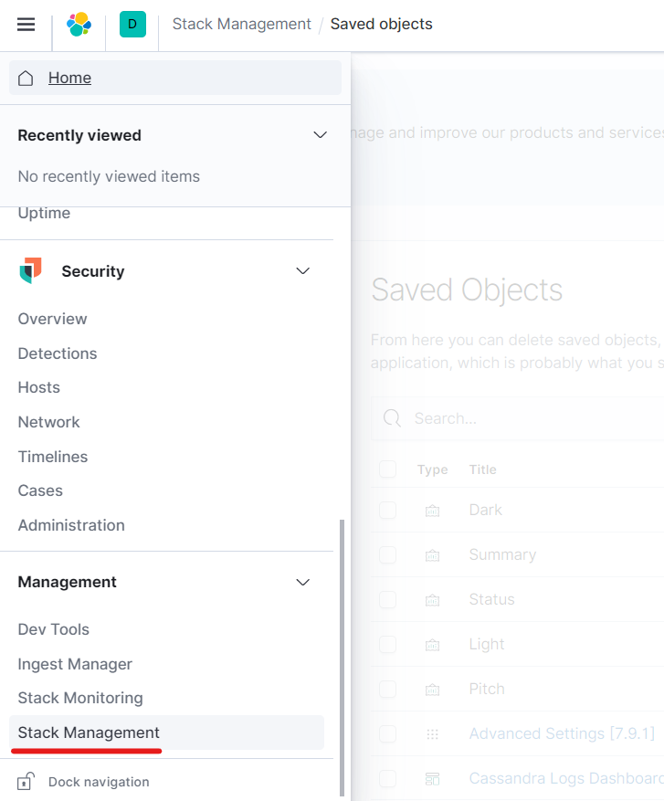

#### Step B.2: Open Saved objects view 
Click `Kibana` > `Saved Objects` on the left menu. (or just go to http://<your-kibana-host>:5601/app/management/kibana/objects).

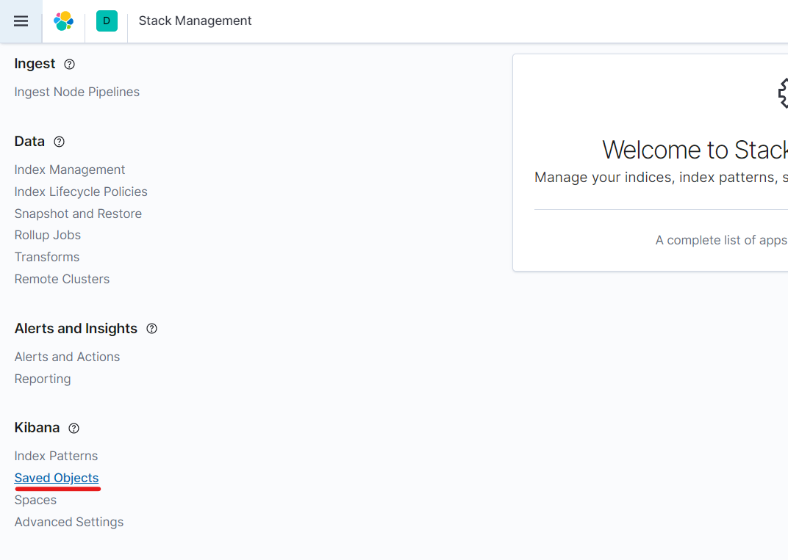

#### Step B.3: Upload the file
Click "Import" then upload the ndjson file. 

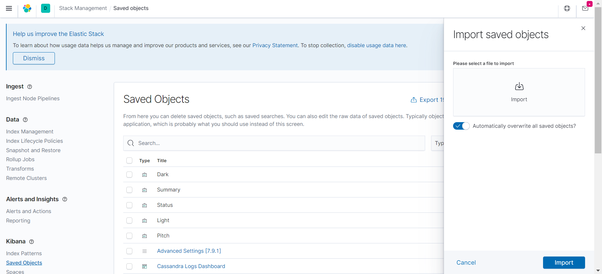

#### Step B.4: Open the Dashboard
In the sidebar, click on `Kibana` > `Dashboard` to open the dashboard view and select the `Cassandra Logs Dashboard`.

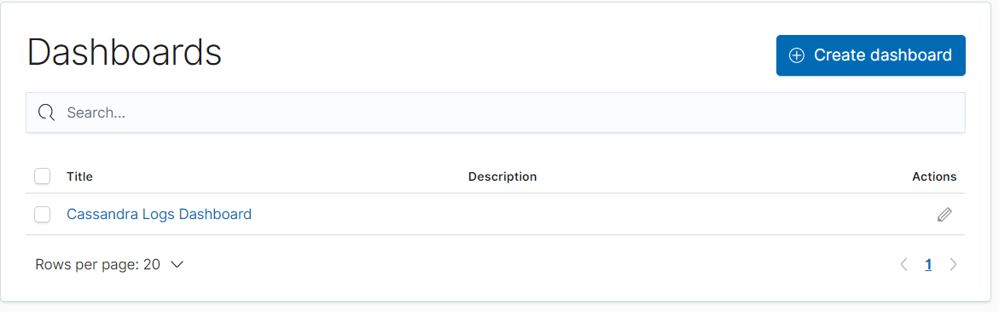

#### Step B.5: Change the Time Filter
Kibana will default to only showing the last 15 minutes. The makes more sense if you are monitoring a live cluster, but if you are doing offline log ingestion, make sure to change this to something more reasonable

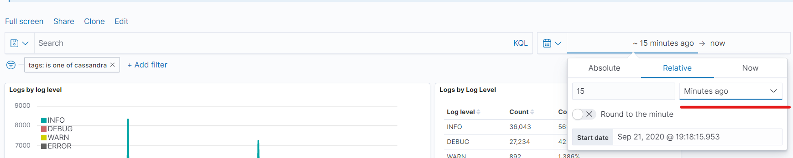

# Interpreting the pre-defined visualizations
### Charts we provide
Currently we have some timelion charts with corresponding data tables next to them. 

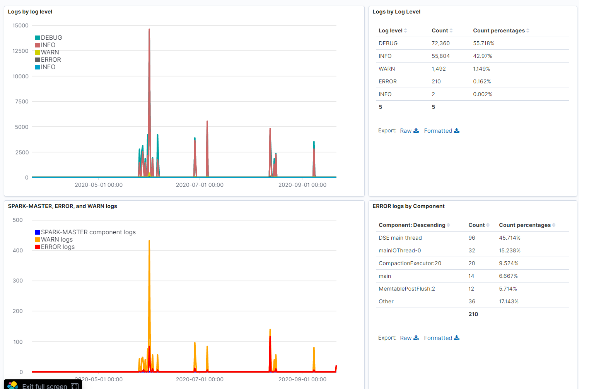

Note that the data tables sometimes have extra filters that the timelion to its left does not have. E.g., sometimes a table has an extra filter that only shows loglevel ERROR logs, whereas the timelion to its left doesn't. 

Be careful to read the labels and look at the source queries if you are not sure.

### Default Filters
By default we are filtering out logs that are not tagged as "Cassandra". For what logs have that tag, see our generated filebeat.yml file. You can easily change this in the dashboard by clicking the X next to the filter (in the top left corner).
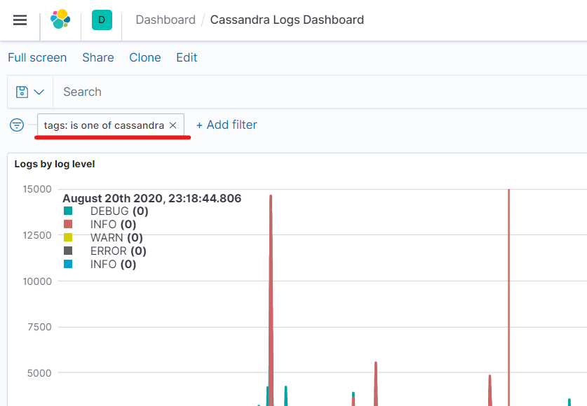

## Interacting with the Dashboard

Sometimes the dashboard might give more information than you need. You can of course edit each visualization yourself by clicking on "Edit" and then going to a specific visualization and modifying it to your liking.
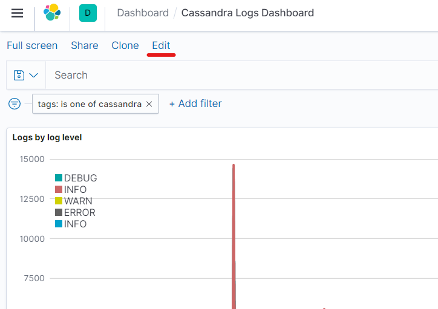
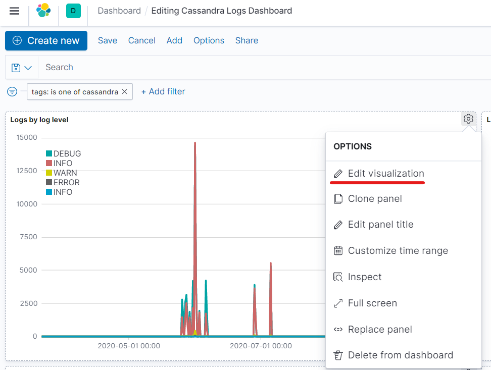

However, you can also hide certain logs by clicking on their labels to quickly remove extra noise.
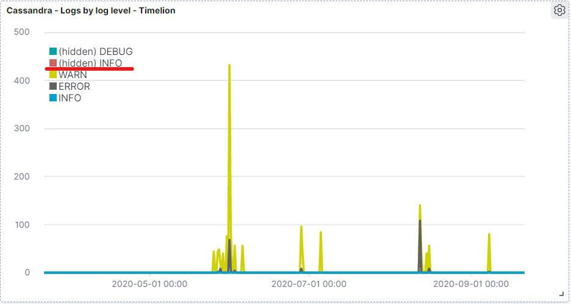


## Use our Pre-defined Queries

We also have some predefined queries that you can use in order to find out more details about the actual logs. 

**To view our sample queries in the Discover view:**
1) Go to the "Discover" view (found in the hamburger menu, or at `http://<kibana-host>:5601/app/discover`). 
2) Then click on the dropdown that looks like a floppy disk. You can see some sample queries to get you started.
    - Note that you will probably have to expand the time range filter to include more than the "Last 15 minutes", given that this is offline log analysis and the logs are likely going to be from before 15 minutes ago.
    - Expand the time range by clicking in the field on the top right corner:
        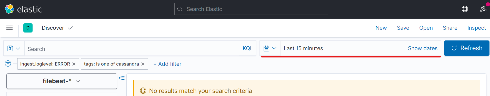

**Want more Examples?** Find inspiration from the dashboard visualizations! If you look at the source filters/queries for the timelion charts or the data tables in the dashboard, that might also give you some ideas of queries to use in the "Discover" view.
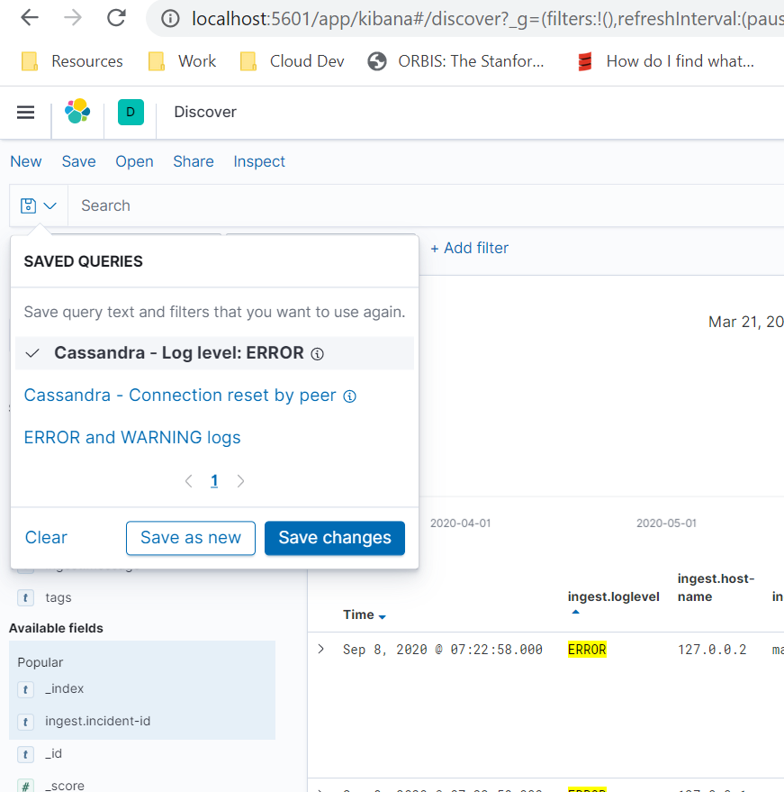

## Other Queries to Consider
Our filebeat.yml adds the following fields: 
- `ingest.loglevel`: log level for the log, e.g., `ERROR`, `WARN`, `INFO`, `DEBUG`
- `ingest.component`: Component for the log
- `ingest.class`: Java Class that is related to this log e.g., `CassandraDaemon` 
- `ingest.host-name`: ip of the node that generated this log, e.g., `1.2.3.4`. Extracted from the filepath of the log archive
- `ingest.message`: takes what's left of the log message and outputs it here.
- `ingest.incident.id`: this is the incident id that we generate in the offline-log-ingester tool. It is based on last modified date of the tarball that got ingested. 
- `log.file.path`: Actually, we don't set this one, it's set by default. But gives the path to the file. Useful for searching for particular log files. E.g., you can do a search like this: `log.file.path:*gremlin.log` to get only gremlin logs.
- `tags`: tags we set based on what type of log it is. 
    * One tag in particular that we want to highlight is that whatever `client_name` you passed in when running `ingest_tarball.py` is set on the tags as well, so you can query for that if you want.
    * We also set `cassandra`, `spark`, or `linux-system` depending on where this log originated from, as determined by the file path in the log archive that we ingested.
    * To find all the tags we set, check out [`filebeat_yml.py`](../offline-log-ingester/helper_classes/filebeat_yml.py) under the `log_type_definitions` variable.

Of course, you can also just query the raw log message that these other fields were extracted from (namely, `message`).

## Further Reading
Want more information on how to use Kibana to analyze your logs? Here are some links to get you started:
- https://blog.anant.us/cassandra-lunch-14-basic-log-diagnostics-with-elk-fek-bek/
- https://blog.pythian.com/cassandra-open-source-log-analysis-kibana-using-filebeat-modeled-docker/

# Development

## Add a new visualization
- Don't save the time filters. This way, the time filter will only be set by the dashboard, not the visualization.
- Probably do save the filters, assuming that the filter is an important part of the visualization.
- Please let us know if you have any other ideas of helpful visualizations, and feel free to make a PR as well!

## Export saved dashboards, queries, and visualizations
### Export Using Kibana GUI
https://www.elastic.co/guide/en/kibana/7.8/managing-saved-objects.html#managing-saved-objects-export-objects
Our Dashboard is Called "Cassandra Logs Dashboard", and we have some queries namespaced with the word "Cassandra" as well so search for "Cassandra" in the saved objects search bar to find our dashboard and queries. Make sure to save all related objects.

### Export Using API
(Have not tried yet)
https://www.elastic.co/guide/en/kibana/7.8/saved-objects-api-export.html#ssaved-objects-api-create-example


## TODOs
- add scripts to take advantage of the export/import saved objects api, to make importing even easier

# Debugging
## Dashboard import does not work due to conflict
E.g., if you import the dashboard using REST API, our bash script (`./scripts/import-dashboard.sh`) or through the GUI, and it says there is a conflict, and you see something like this in the response:


`Conflict` here means something with the same id already exists. You can either just ignore the error message and see if it works (note that other items still import), or if too much didn't import and something broke, remove the "Index Patterns" and the "Saved Objects" (either using REST API or Kibana GUI) and import again. 
