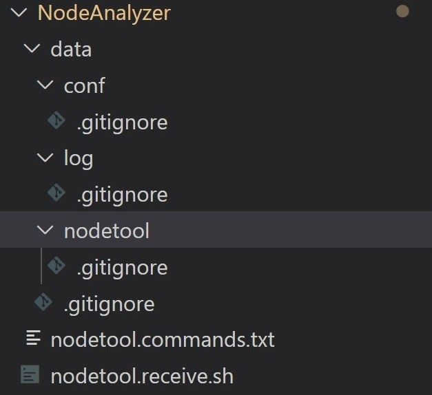

# cassandra.toolkit/NodeAnalyzer
A quick and dirty tool to grab all the information for a specific node and tarzip it into a ball. 

TODO: Later will be integrated better with how TableAnalyzer goes and gets all the data for a cluster. 

Please make sure you move the empty data/* directories if you move this script out. It uses a relative directory reference. 



## Basic Usage
### Version 1 (the original)
```
bash ./nodetool.receive.sh {logdirectory} {confdirectory} {datacentername} {0|1} (verbose)"
```

### Version 2
```
./nodetool.receive.v2.sh {logdirectory} {confdirectory} {data-dir-path} {0|1} (verbose)"
```

## Use v1 or v2?
You can choose to use `nodetool.receive.v2.sh` or the original, `nodetool.receive.sh`. 

The reason why there are two is that we needed some changes to be made in order to run it within cassandra.vision's offline-log-collector, which is why we made `nodetool.receive.v2.sh`. However we also wanted backwards compatibility, so kept the original around. 

Here's a summary of the differences:

| Feature | `nodetool.receive.sh` (the original) | `nodetool.receive.v2.sh` |  
| ------- | ------------------------------------ | ------ |  
| Support for specifying `data` dir path | Not supported. Requires a dir named `data` to be found relative to wherever you call the script from. | The third arg is the `data_dest_path`, though if you only have two args, it defaults to same behavior as v1. |  
| Specifying datacenter name  | Third arg is for specifying datacenter name. However, it is currently not used in current implementation of nodeanalyzer | Not used at all. |  
| Support for skip archiving | Not supported. Always archives.  | Supported by env var `NODE_ANALYZER_SKIP_ARCHIVING`. Defaults to `false`.  |  
| Support for specifying jmx port | Not supported. Just uses default port used by nodetool. | Supported by env var `NODE_ANALYZER_SKIP_ARCHIVING`. If left blank, nodetool default is used. If specified, sent to nodetool using `-p` arg. |  
| Support for specifying command for nodetool | Not supported. Just uses `nodetool`. | Supported by env var `NODE_ANALYZER_NODETOOL_CMD`. Defaults to `nodetool`. Useful if you're using DSE or Apache C* tarball installation, or ccm |  
| Copy linux system logs | Does not copy linux system logs | Tries to copy linux system logs, but if it doesn't find the log continues without throwing an error. Looks in all paths specified in `NodeAnalyzer/nodetool.linux-log-paths.txt` |  
| Run without root privileges | Does not require root privileges | Requires root privileges since it copies the linux system logs |  
| Generate directories for you | User is required to make the data dir and subdirs themselves. | Makes the directories for you wherever the `data` dir was set using the third arg. |  

## Examples:

### Verbose output 

```
bash ./nodetool.receive.sh /var/log/cassandra /etc/cassandra DC1 1
```

### Silent output 

```
bash ./nodetool.receive.sh /var/log/cassandra /etc/cassandra DC1 0
```

## Implementation Notes:
- It uses `hostname -i` to get the IP address to name the tar.gz file

## Want to run other nodetool commands?
If you want, you can add other nodetool commands to nodetool.commands.txt

http://cassandra.apache.org/doc/latest/tools/nodetool/nodetool.html
