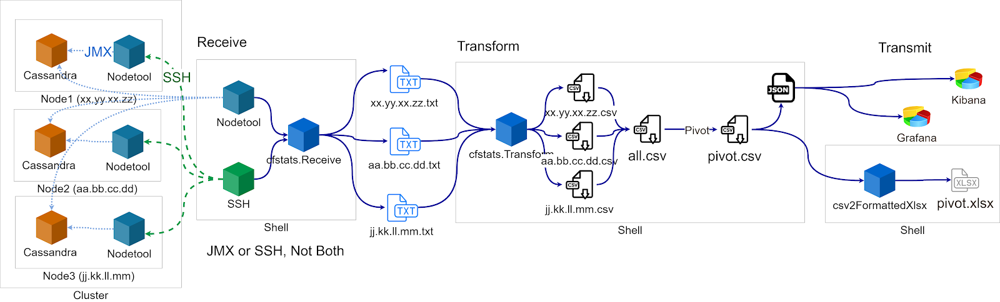
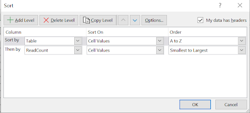
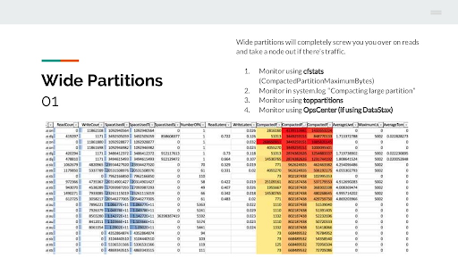
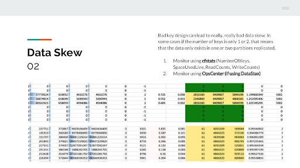
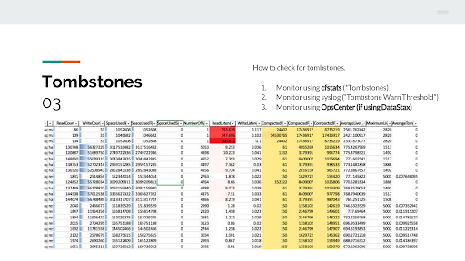

# cassandra.toolkit/TableAnalyzer

## Introduction

TableAnalyzer is a tool for analyzing Cassandra (CFStats/TableStats) output that visualizes variance in metrics between nodes. We use TableAnalyzer to generate a conditionally-formatted spreadsheet that can be used to perform data model review.

### TableAnalyzer Among Other Cassandra Tools

This is the first of many tools we've been working on that help understand what's going on in a Cassandra cluster. It's not supposed to replace OpsCenter, Prometheus+Grafana, or other tools out there which chart various Cassandra metrics over time. 

Instead, TableAnalyzer takes the table stats from all of the nodes at a specific point in time in order to compare across nodes rather than comparing across time. This allows us to identify issues such as tombstones, wide partitions, and different kinds of skew. The goal is to eventually build intelligence in here to help people build better tables through analysis of the keys, etc.

### Purpose

This tool was created because we had a hard time explaining to non-believers that data-model issues were the reason their "amazing app" crashed all the time, and that it wasn't Cassandra's fault. TableAnalyzer generates a conditionally formatted spreadsheet which makes it easy to not just locate potential data modeling issues, but also provide quantifiable statistics to back it up. 
 
### What TableAnalyzer Actually Does

TableAnalyzer can be broken down into two functions: 1) Collect cfstats/tablestats Output (“Receive”) and 2) Visualize cfstats/tablestats in an Excel Spreadsheet and JSON file (“Transform”).



#### Collect cfstats/tablestats Output

TableAnalyzer can collect the cfstats/tablestats by:

* Using the extracted contents of a diagnostics tarball from DSE OpsCenter
* Running nodetool cfstats or nodetool tablestats from a local Cassandra/Cassandra compatible* instance
* Running nodetool cfstats or nodetool tablestats from a Cassandra/Cassandra compatible* instance through SSH

*By Cassandra compatible instance, we are referring to DSE, open source Cassandra, Elassandra, or Scylla. However, note that so far we have only tested with DSE and open source Cassandra.

#### Visualize cfstats/tablestats (Excel Spreadsheet and JSON)

Once it has the stats, TableAnalyzer parses and transforms the stats into a CSV file format, which then is transformed into a conditionally formatted Excel file (xlsx). It also creates the data set as JSON which can be then sent to ElasticSearch, New Relic, etc. for further visualization.

## Installation and Setup

### Install dependencies

Install Python dependencies using pip. Make sure to use pip3 / python3:

```pip3 install -r requirements.txt```

### Prepare for SSH: Add SSH Keys (if using SSH)

NOTE: This is only applicable if you are using SSH to run nodetool commands on Cassandra nodes.

You will need to add copy your pem files to where TableAnalyzer can find them. In the TableAnalyzer directory, in a folder keys, add pem files needed to ssh into each node to be analyzed. 

```
mkdir -p cassandra-analyzer/offline-log-collector/TableAnalyzer/keys/
cp <path-to-pem-file>/my-private-key.pem
cassandra-analyzer/offline-log-collector/TableAnalyzer/keys/
```


These will need to be referenced in your environments.yaml file in the next step.

### Set configuration: Create environments.yaml file

From the TableAnalyzer directory, in folder ```./config```, create the file ```environments.yaml```. If it does not yet exist, use a copy of ```environments-sample.yaml```:

```
cd cassandra-analyzer/offline-log-collector/TableAnalyzer/config/
cp ./environments-sample.yaml ./environments.yaml
vim environments.yaml
```


Now fill out each region, each cluster for each region, each datacenter for each cluster, and each node’s ip address for each datacenter.

#### Setting the different values in the environments.yaml config
TableAnalyzer needs to the topology of your clusters. Specifically, we refer to the region, cluster, datacenter, and nodes in both the environments.yaml config file and in the CLI argos when you run the script.

Note that TableAnalyzer only runs on a single datacenter at a time, and consequently the spreadsheet that TableAnalyzer generates is only for a single datacenter. If you want to analyze several datacenters, you will have to run TableAnalyzer multiple times. However, if you put the information for all of your datacenters in the single environments.yaml file, you can use a single environments.yaml config file and TableAnalyzer will know what datacenter to run against by way of CLI args. 

Below is a description of how we use the values set for region, cluster, and datacenter in our script.

"Region"
* Should probably be one of: us-east-1|usw|us|uswest (or something like that)
* The same kind of idea as "environment", we use only for our script to namespace these nodes

In our examples below, we use uswest for our region.

"Environment"
* Should probably be one of: dev/stage/prod
* is just a way to namespace these nodes for use by script.
* * Does not have an impact on where the script looks to collect the files from, but hasn't impact on the path we collect the files to. (will go to: data/<region>/<environment>/<ip>.txt

In our examples below, we use prod for our environment.

"Datacenter"
Often we use one of “cassandra” or “spark” in our examples, but really this can be any arbitrary string, just needs to be whatever we defined in the environments.yaml file, and line up with the directory we created in the data file. For example, can also be “dc1” etc.

In our examples below, we use cassandra for our datacenter.

#### Example Configuration
```
# region:
#  cluster:
#    datacenter:
us:
  prod:
    cassandra:
      - 192.168.0.1
      - 192.168.0.2
      - 192.168.0.3
    spark:
      - 192.168.0.4
    key: keyfile.pem
  prod2:
    cassandra:
      - 192.168.0.11
      - 192.168.0.12
      - 192.168.0.13
    spark:
      - 192.168.0.14
    key: keyfile.pem 
  stage:
    cassandra:
      - 192.168.1.1
      - 192.168.1.2
      - 192.168.1.3
    spark:
      - 192.168.1.4
    key: keyfile.pem
```

#### Create Data Directories
Currently, our scripts do not make data directories for you, and so you have to make directories for each database first in the TableAnalyzer directory, within the data folder. 

``` 
# mkdir -p ./data/<region>/<environment>
mkdir -p ./data/uswest/prod 
```
## Collect Tablestats/CFStats Output

Table Analyzer can collect the cfstats/tablestats by:

1. Using the extracted contents of a diagnostics tarball from DSE OpsCenter
2. Running nodetool cfstats or nodetool tablestats from a local Cassandra/Cassandra compatible* instance
3. Running nodetool cfstats or nodetool tablestats from a Cassandra/Cassandra compatible* instance through SSH

### Option #1: Using the extracted contents of a diagnostics tarball from DSE OpsCenter

This option is only possible when using DSE and having access to OpsCenter. 
The DSE OpsCenter tarball has the cfstats/tablestats output contained within it, so we will not need to run nodetool cfstats or nodetool tablestats, but will need to extract the cfstats/tablestats output from the tarball. 

We have written a script for this as well:

```
# unzip tarball
tar xzvf <path-to-unarchived-diagnostics-tarball-dir>/<tarball-filename>.tar.gz -C .

# get tablestats into our data directory
# python3 cfstats.receive.diag.py <region> <cluster> <datacenter> <path-to-unarchived-diagnostics-tarball-dir> <get-all-data {True|False}> <cassandra-major-version> <debug {0|1}>
python3 cfstats.receive.diag.py uswest prod cassandra <path-to-unarchived-diagnostics-tarball-dir> True 3 1
```

### Option #2: Using nodetool cfstats or nodetool tablestats from a local Cassandra instance
Another way to get the tablestats output is to manually run the tablestats command on a local node that is running Cassandra. This command will have to be run several times, with different a different host specified in the environments.yaml file for each node in order to get tablestats output on a multi-node cluster.

```
# python3 cfstats.receive.py <region> <cluster> <datacenter> <debug {0|1}>
python3 cfstats.receive.py uswest prod cassandra 1
```

### Option #3: Using nodetool cfstats or nodetool tablestats from a Cassandra instance through SSH
Using SSH can make this whole process much faster.

First, change settings.json so that our script knows to use SSH:

```
vim ./config/settings.json
# change useSSH to "True"
```

It should now look like this:

```
{
  "connection":{
    "useDiag" : "False",
    "useSSH": "True",
    "detectTopology":"False"
  }
}
```

Now run the script (can use same arguments as when executing locally): 

```
# python3 cfstats.receive.py <region> <cluster> <datacenter> <debug {0|1}>
python3 cfstats.receive.py uswest prod cassandra 1
```

#### Expected result
At this point, there should now be .txt files, one for each node, in the ./data/<region>/<cluster>/ directory (e.g., ./data/uswest/prod).

## Generate Spreadsheet

Now that we have our tablestats output written to .txt files, we want to convert these files into a csv, and then convert that csv into a .xlsx format. The advantage of using the Excel format is being able to use formatting, and in particular conditional formatting. This conditional formatting will make it easy to see differences between nodes and outliers.

### Convert to CSV

```
# python3 cfstats.transform.py <region> <cluster> <datacenter> <cassandra-major-version> <debug {0|1}>
python3 cfstats.transform.py uswest prod cassandra 3 1
```

#### Expected result:

* There should now  be .csv files, one for each node, in the ./data/uswest/prod dir
* There might also be a few other outputted csv files that aggregate for each node (e.g., uswest.prod.cfstats.csv, uswest.prod.cfstats.issues.csv, uswest.prod.cfstats.pivot.csv) and json file (e.g., uswest.prod.cfstats.pivot.json)
* * uswest.prod.cfstats.pivot.csv is the most important one

#### Convert to spreadsheet
For this we use csv2formattedxls.py:

```
# python3 ./csv2formattedxls.py ./data/<region>/<cluster>/<region>.<cluster>.cfstats.pivot.csv ./data/<region>/<cluster>/<region>.<cluster>.cfstats.pivot.xlsx
python3 ./csv2formattedxls.py data/uswest/prod/uswest.prod.cfstats.pivot.csv data/uswest/prod/uswest.prod.cfstats.xlsx
```
## Analyze Tablestats using Spreadsheet

### Introduction 

Now that we have a spreadsheet to help us visualize our table stats, we can now analyze the data and search for problems in our data model. There are three main problems that we generally look for, which we like to call “The Three Stooges” of Cassandra: 

* Wide Partitions
* Skew
* Tombstones
 
#### How to use the spreadsheet

The spreadsheet by default shows information for each node (column: “Hostname”) by table (column: “Table”). This means that we can easily find different kinds of skew by sorting rows by one of the other columns, and then comparing values in that column to other nodes that hold data for a particular table. 

For example, to find “Traffic Skew” for reads, we can sort by “Table” first, then by “ReadCount”.



Now, all nodes that hold data for a given table are grouped together, and the read counts for each node can be easily compared to each other.

A similar process can be applied for other types of skew as well as Wide Partitions and Tombstones. We sort primarily by the tablename, and then secondarily by the column that is relevant for the particular type of datamodel issue that we want to identify.
 
#### Further Reading

For further information on identifying and solving these data model issues, see our blog at https://blog.anant.us/common-problems-cassandra-data-models/. This documentation borrows heavily from this blog post as well.

### Stooge #1: Wide Partitions



Description:
A partition is the fundamental unit of replication in Cassandra. A wide partition means that data is collecting in a large bucket rather than smaller ones. Partitions should not be bigger than 100MB.


Potential Side-effects:
Wide partitions can potentially cause latency since it takes longer to perform reads and writes when the partition is large. Wide partitions can also potentially create a large amount of tombstones. See below for information on identifying tombstones.

How to Identify Using Spreadsheet:
* Sort by column “CompactedPartitionMaxBytes” (avg, and min also good)

### Stooge #2: Skew



#### Introduction
You can find information on different types of skew below, including what columns in the spreadsheet to sort by in order to find that particular type of skew. 

#### Partition Skew
Description: 
Partition skew is when a particular table has some partitions that are significantly larger size than others. Wide partitions (the first of the “Three Stooges”) is always a problem, but sometimes some nodes have wide partitions though others do not. If so, this kind of skew can be a cause and/or symptom of a different data model issue and require a different solution. 

The size of a partition can be “larger” either when measuring by bytes (e.g., one node has partitions for a given table that are 500MB and another that has partitions that are 50MB) or when measuring by row count (e.g., one node has partitions for a given table that hold 500 rows and another node has partitions for that table that hold only 100 rows). Either way, this kind of skew will have an impact on Cassandra’s performance.

nodetool tablestats does not return row counts, but it does return the partition size in bytes. Also, since the partition key for this table will have a direct impact on the partitioning, partition key count should be looked at as well.

Look for: 
* Keys/Partitions across Nodes for Table

How to Identify Using Spreadsheet:
Sort by partition-related values (columns: “CompactedPartitionMinimumBytes”, “CompactedPartitionMaximumBytes”, and “CompactedPartitionMeanBytes”) and partition-key count (column: “NumberOfKeys”).  

#### Data Skew
Description:
Data skew is when the SSTables count or disk space size for a particular Cassandra table is unevenly distributed across nodes (e.g., one node has 100 sstables and another has only 10 sstables).

Look for: 
* SSTables number across Nodes for Table
* Live Data across Nodes for Table
* All data / Snapshot Data across Nodes for Table


How to Identify Using Spreadsheet:
Sort by values related to disk space (columns: “SpaceUsedlive”, “SpaceUsedTotal”, and “SpaceUsedSnapshots”) and SSTable count (column: “SSTableCount”). 


#### Traffic Skew
Description:
Traffic skew refers to Read and/or Write discrepancies across nodes for a given table. Also watch out for tables that do not have any reads or writes at all. 

While this is not an indicator of “skew”, this does mean that this table is not being used at all and you should consider backing up the data somewhere and then dropping the table altogether so Cassandra does not have to continue managing the rows for this table.

How to Identify Using Spreadsheet:
Sort by values related to read and write count (columns: “ReadCount” and “WriteCount”). 

#### Tombstone Skew
Description:
Tombstone skew is when there is an uneven distribution of tombstones across nodes for a given table. A large amount of tombstones (the third of the “Three Stooges”) is always a problem, but sometimes some nodes have a large amount of tombstones though others do not. If so, this kind of skew can be a cause and/or symptom of a different data model issue and require a different solution. 

How to Identify Using Spreadsheet:
Sort by Tombstone related values (columns: “AverageTombstones”, “MaximumTombstones”) and look for large discrepancy between nodes.


#### Latency Skew
Description:
Latency skew is when there is an uneven distribution of read or write latency across nodes for a given table. 

How to Identify Using Spreadsheet:
Sort by values related to Latency (columns: “ReadLatency”, “WriteLatency”).

### Stooge #3: Tombstones



Description:
Tombstones are Cassandra’s way of being efficient with writes. It deletes data after the fact in compactions. When data is deleted, or a null value is inserted/ updated in an existing table, a tombstone record is added. 

When under normal levels, they are not a problem. They become problematic when tremendous amounts of tombstones accumulate together because of frequent updates that add nulls, wide partitions with many rows in one partition, or due to data skew.  What Cassandra does on a read is to reconcile the immutable writes into the current state of the data. This takes memory and computation and is magnified even more if the partition is large.


How to Identify Using Spreadsheet:
Sort by Tombstone related values (columns: “AverageTombstones”, “MaximumTombstones”) and look for high tombstone values.

Potential side-effects
* Latency
* Skew
Potential Causes
* Skew
* Wide Partition

## Credits
1. Rahul Singh - Concept, Initial Version
2. Tom Hada - Refactoring, Code Cleanup
3. Rohan Bane - Refactoring, Dockerization, Gridview Start
4. Jagannath Bilgi - Refactoring, Testing
5. Shridhar Nandeshwar - Testing, User Feedback
6. Senthilvel Palaniappan - Testing, User Feedback
7. Ameer Ajmal Baig - Refactoring, Testing, Documentation User Feedback
8. Pramod Pottimuthu - Testing, User Feedback
9. Clyde Clark - Testing, Documentation, User Feedback
10. Ryan Quey - Documentation

The very original original original code came from "https://github.com/thejaspm/cfstatsParseVisualize" which has been worked over several times. In the spirit of open source, credit goes to https://github.com/thejaspm for starting it off.

This documentation borrows heavily from this blog post as well.
