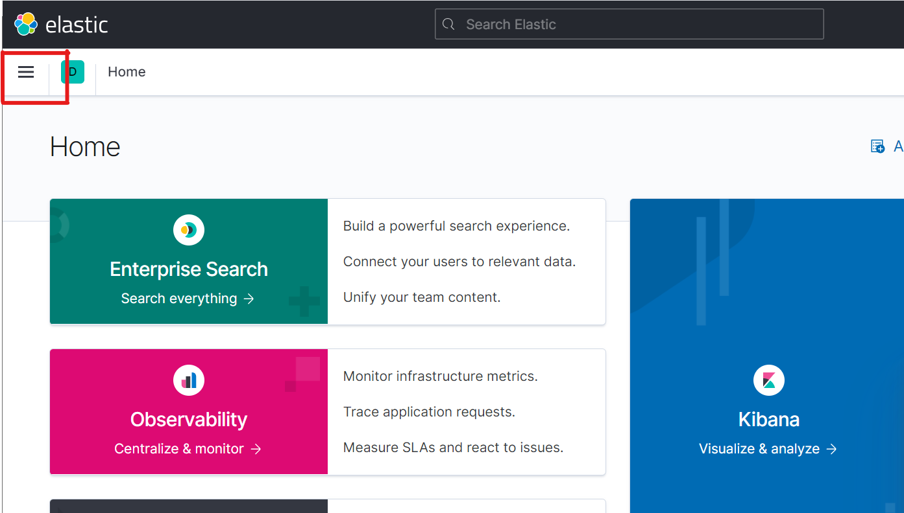
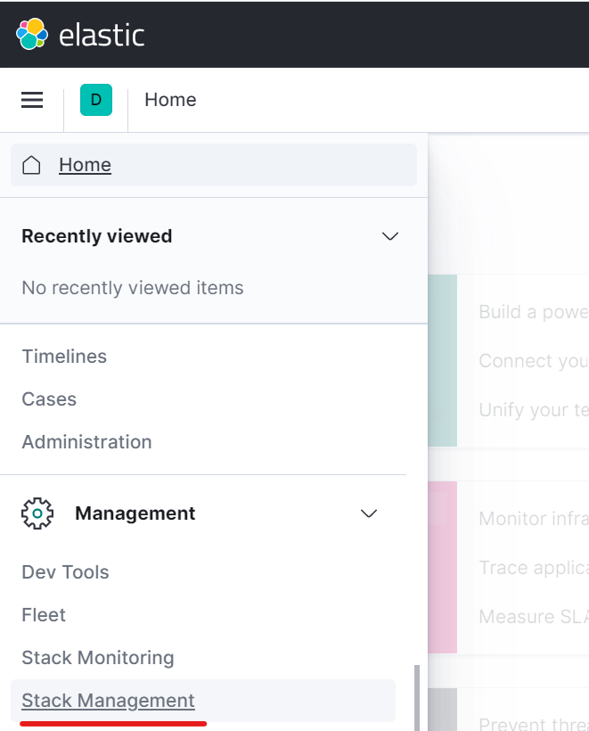
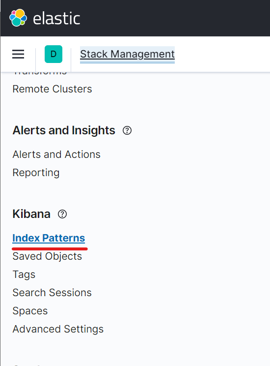
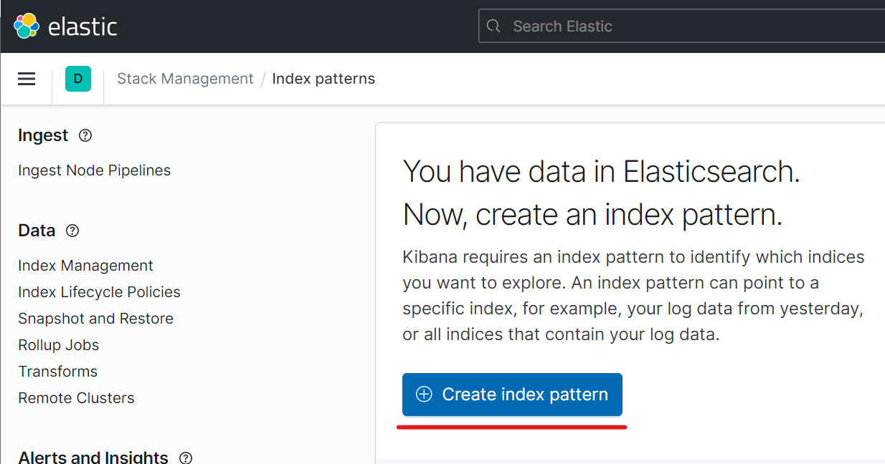
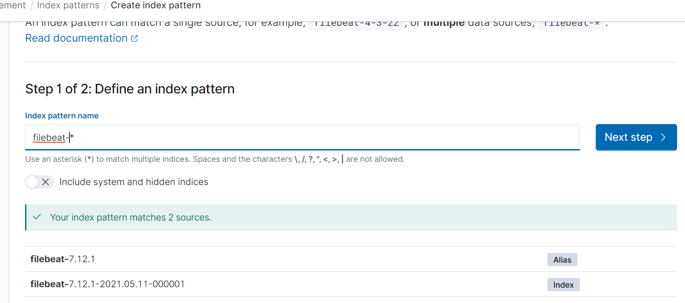
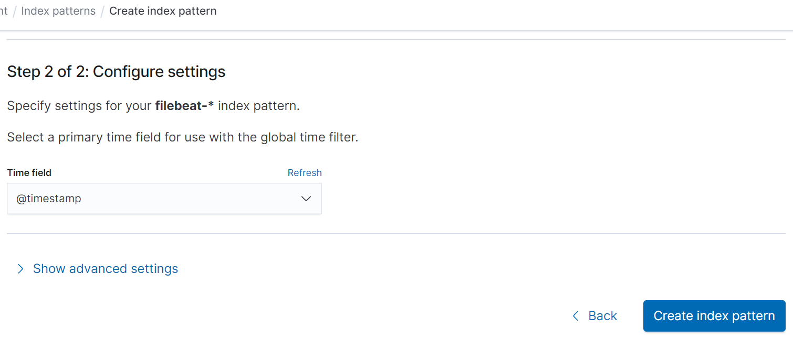

# Ingest Tarball of logs into Kibana
After you collect your logs from your Cassandra cluster (either using [offline-log-collector](../offline-log-collector/README.md) or from getting a diagnostic tarball from DSE opscenter), you need to ingest it into your Dashboard. This is what this tool is for. Specifically, we ingest into Elasticsearch and Kibana using Filebeat.

Note that we have a starter Kibana Dashboard that you can import into kibana as well. [Click here to check it out](../kibana-dashboard/README.md).

Table of Contents:
- [Overview](#Overview)
    - [What does this script do?](#What-does-this-script-do)
    - [A note about how offline-log-ingester uses Filebeat](#A-note-about-how-offline-log-ingester-uses-Filebeat)
- [Step 1: Setup](#Step-1-Setup)
    - [Step 1.0: Prerequisites](#Step-10-Prerequisites)
    - [Step 1.1: Install Requirements](#Step-11-Install-Requirements)
    - [Step 1.2: Position your tarball](#Step-12-Position-your-tarball)
- [Step 2: Determine the arguments you will use](#Step-2-Determine-the-arguments-you-will-use)
- [Step 3: Execute the python script](#Step-3-Execute-the-python-script)
- [Step 4: View the Logs in Kibana](#Step-4-View-the-Logs-in-Kibana)
    - [Option A: Import our Dashboard](#Option-A-Import-our-Dashboard)
    - [Option B: Manually Add an Index Pattern for Filebeat](#Option-B-Manually-Add-an-index-Pattern-for-filebeat)
- [Step 5: What's next](#Step-5-Whats-next)
- [Debugging](#debugging)
- [Testing](#testing)
- [Development](#development)

# Overview
### What does this script do?
As a high level overview, the python script for offline-log-ingester:
  - Unzips the log tarball
  - Puts the logs in the folder we want it in (`./logs-for-client`)
  - Generates a filebeat.yml to target these logs
  - And finally, starts filebeat for one-off batch job that ingests these files into ELK

### What is produced at the end?
Upon completion, you should have everything ready to view your logs in a nice dashboard in Kibana. You also have a filebeat.yml file that you can reuse if you want to. 

### A note about how offline-log-ingester uses Filebeat

In case you have not used Filebeat before, we just want to point out that filebeat is normally used on a live cluster, and is constantly sending logs as they change to Elasticsearch. For our use case however, we are doing offline log monitoring. Moreover, we want to run filebeat using our custom built filebeat.yml that targets our diagnostic tarball and then be able to stop filebeat and run it again on a different set of logs, whereas when doing online log monitoring, filebeat would be continually running and monitoring the same folders all the time.

Consequently, instead of leaving Filebeat on in the background, and letting it continue to watch our logs, we are running it once on the logs from our tarball instead, and then turning it off.

Keeping this in mind will help you understand the behavior of filebeat and how we are using it here.

# Step 1: Setup
### Step 1.0: Prerequisites
- Requires python3 and pip3
- Currently also requires `filebeat` to be callable from the commandline (ie make sure it's on the linux path).
- A log tarball, either using [offline-log-collector](../offline-log-collector/README.md) or from getting a diagnostic tarball from DSE opscenter. 
    - If you have a tarball in a different format, or if you are having trouble using our tool and need to double check, [click here to find out what format our tool expects the log tarball to be in](./ingestion.tarball-format.md).

### Step 1.1: Install Requirements

- Install required python modules:
    ```
    pip3 install -r requirements.txt
    ```

- Make sure ES and Kibana are running already (we will start filebeat later).
    - If you have not installed Elasticsearch and Kibana yet, you can see [our instructions here](../README.md#step-1-installing-elasticsearch-filebeat-and-kibana).

### Step 1.2: Position your tarball
Place a log tarball in `./log-tarballs-to-ingest/` 

* Make sure that this is the tarball either generated by our `collect_logs.py` script or by Opscenter. 
    - If it is not, [click here to find out what format our tool expects the log tarball to be in](./ingestion.tarball-format.md).

# Step 2: Determine the Arguments You Will Use
Before running the script, you will want to make sure to run it with the arguments that fit your setup. The only required argument is a "client name", however there are several optional arguments that you might want to consider as well.

### Choose a "client name" (required)
The only required argument is a "client name", which is basically just an arbitrary string that distinguishes this tarball from other tarballs. 

We call it "client name" since we often use this string to distinguish tarballs that we receive from different clusters that we maintain from each other. You can use this to distinguish tarballs received from different datacenters from each other or anything that you want to do.  

### Specifying Elasticsearch host (optional)
By default the script is pointing towards a elasticsearch instance running on localhost. To specify a different host, use the `--es-host` arg:
```
--es-hosts 123.456.345.123:9200
```

Notes:
- This will be used to set `output.elasticsearch.hosts` in the filebeat yaml
- Unlike using --custom-config, this will set the es host for the es python client the script uses. Right now the client only gets used if you also use the `--clean-out-filebeat-first` flag, but that might change in the future. 
- If you also set a `--custom-config` flag for `output.elasticsearch.hosts`, that will override what you set for es-host in the yaml, but will not be used for the es python client.

### Specifying Kibana endpoint (optional)
By default the script is pointing towards a kibana instance running on localhost. To specify a different kibana host, use the `--custom-config` arg. This arg requires a key (can be nested path by using a dot-separated string, as we use here with `setup.kibana.host`) and a value. 

E.g.:
```
--custom-config setup.kibana.host 123.456.345.123:5601
```

### Cleanout Filebeat Before Ingesting (optional)
***DANGER**: Note that this will delete data within Elasticsearch and remove files in filebeat*

If you want to clear out your filebeat indices and your filebeat registry, you can use the --clean-out-filebeat-first flag. E.g., 

```
python3 ingest_tarball.py my-client-logs-tarball.tar.gz my_client --clean-out-filebeat-first
```

This does two things: 
1) clears the filebeat registry, which lets filebeat run on the same logs again (otherwise, if registry was not cleared, filebeat would ignore these files since it ingested them already)
1) clears elasticsearch indices related to filebeat, lets you start with a clean slate and ensures you won't see logs from a different tarball in Kibana.

This is the equivalent of:

```
curl -XDELETE 'http://<elastic-host-ip>:9200/filebeat-*'
rm -rf /var/lib/filebeat/registry/
```

Our python script will target `localhost` by default, or whatever elasticsearch ip is provided using `--es-host`, [as described above](#Specifying-Elasticsearch-host-optional).

Note that this will also remove any other files from the filebeat registry and any other documents from your filebeat index in elasticsearch. You probably only want to do this if the only thing you use filebeat for is cassandra.vision. 

***DANGER**: Note that this will delete data within Elasticsearch and remove files in filebeat*

### Debug mode (optional)
You can also use `debug_mode` if you don't want to write anything to Elasticsearch yet. This will make filebeat outputs to console rather than ingesting any logs to ES. This is done by using the `--debug-mode` flag:
```
python3 ingest_tarball.py my-client-logs-tarball.tar.gz my_client --debug-mode
```

Under the covers this sets `output.console.pretty` to True, and removes `output.elasticsearch.hosts` from the generated filebeat.yml file.

See here for [official filebeat docs](https://www.elastic.co/guide/en/beats/filebeat/current/console-output.html).

### Arbitrary config for the filebeat.yml (optional)
Sometimes you want to customize the filebeat.yml that our script generates further and programmatically. The the `--custom-config` flag lets you do that.

This arg requires a key (can be nested path by using a dot-separated string, as we use here with `setup.kibana.host`) and a value. 

E.g., 
```
--custom-config setup.kibana.host 123.456.345.123:5601
```

Note: this arg can be used multiple times to set multiple values. For example:
    ```
    --custom-config setup.kibana.host 123.456.345.123:5601 --custom-config some.other.key my-value
    ```

### Cleanup generated files (optional)
To cleanup all generated files if the script run successfully, pass in:
```
--cleanup-on-finish
```

If set, removes the directory found for the "client name" you passed in. E.g., if client name is "test_client", it is equivalent of:

```
rm -rf cassandra-analyzer/offline-log-ingester/logs-for-client/test_client/
```

If it worked, you should see this output at the end of the ingestion run:

```
=== Cleaning up ===
Cleanup Successful.
```

### Ignore zeros in tarball (optional)
If you are using a combined tarball, you will want to ignore zeros in the tarball. See [here](https://www.gnu.org/software/tar/manual/html_node/Ignore-Zeros.html) for what we are doing. 

```
--ignore-zeros 
```
- NOTE currently only works with gzipped tarballs (ie file extension tar.gz).
- [You can find instructions on combining tarballs here](../offline-log-collector/README.md#combining-tarballs).


# Step 3: Execute the Python Script
Now that your tarball is in the correct directory and all prerequisites are ready to go, and you know what arguments you will use, you are ready to finally execute the python script.

### Run using default configuration

To run the script without passing any extra arguments,
Run a script, passing in an arbitrary string as a "client name" about the tarball. E.g.,

```
python3 ingest_tarball.py my-client-logs-tarball.tar.gz my_client
```

At this point, filebeat will start running and you should be able to start seeing logs in Kibana. 

When Filebeat has finished ingesting all of the log files, you can close it using `ctrl+c`. 

### How you know when it's finished
You will know it's done when the STDOUT slows down, and you see a lot of logs that say things like:

- `Stopping harvester for file`
- `harvester cleanup finished for file`
- `input states cleaned up. Before: 0, After: 0, Pending: 0`
- `Start next scan`

For example:

If your logs look like that, close the process using `ctrl+c` so the python script knows to quit. Now you're finished!

### What should the script do:
Let's assume you run the command using the tarball name "my-client-logs-tarball.tar.gz" and "client name" `my_client`, e.g., 

```
python3 ingest_tarball.py my-client-logs-tarball.tar.gz my_client
```

1) This will look for a tarball at `./log-tarballs-to-ingest/my-client-logs-tarball.tar.gz` and extract the contents to `./logs-for-client/my_client/incident-{incident-id}/tmp`
2) Then it will reposition the Cassandra logs into `./logs-for-client/my_client/incident-{incident-id}` (creating one dir per Cassandra node). 
3) It will then dynamically generate a filebeat.yaml based on the logs it finds at `./logs-for-client/my_client/tmp/filebeat.yml`
4) Finally, it will execute filebeat using this generated filebeat.yml.

Now you can head over to Kibana and start your log analysis! To import our Kibana Dashboard, [click here](../kibana-dashboard/README.md).

<br/>

# Step 4: View the Logs in Kibana

If you followed all the instructions up to this point, your logs should be ingested into Elasticsearch, and Kibana should be up and running at port 5601. 

However, unless you have setup Kibana before, there is still some configuration that needs to be done for Kibana to display your logs. 

## Option A: Import our Dashboard

This is by far the recommended way to get started. Simply [follow our instructions here](../kibana-dashboard/README.md), and it will both setup Kibana to visualize your filebeat indexes as well as provide a default dashboard to get you started. 

[Click here to get started](../kibana-dashboard/README.md).

## Option B: Manually Add an Index Pattern for Filebeat

For better or for worse, the Kibana GUI changes from time to time. But the general process should be roughly the same regardless of the version of Kibana you are using. 

>    **Protip:** Having trouble finding this button? Try navigating using the url instead: `http://<kibana-host>:5601/app/management/kibana/indexPatterns/create`. 
> 
> E.g., if kibana is running on localhost: <http://localhost:5601/app/management/kibana/indexPatterns/create>
> 
> Now you can skip to [Step 4.B.5](#step-4B5-Add-filebeat--as-index-pattern) below!

### Step 4.B.1: Click the hamburger icon to open the menu

### Step 4.B.2: Scroll down and on the left-hand side, under "Management", click on "Stack Management"


### Step 4.B.3: Scroll down and on the left-hand side, under "Kibana", click on "Index Patterns"


### Step 4.B.4: Click "Create Index Pattern" Button


### Step 4.B.5: Add filebeat-* as index pattern
Fill in `filebeat-*` Then click "Next step >" to continue.



You should see that it matches the indexes filebeat has created already, as it does in the picture above (ie where it says "Your index pattern matches 2 sources.")

### Step 4.B.6: Set time field to @timestamp
Set time field to `@timestamp` then click "Create index pattern" button.


Now you should be ready to start viewing your logs in Kibana!

### Step 4.B.7: View your logs, and create your own visualizations
You are finally ready to look at your logs in Kibana. 

Navigate over to the "Discover" view (found in the hamburger menu, or at `http://<kibana-host>:5601/app/discover`), and start exploring. 

Note that you will probably have to expand the time filter to include more than the "Last 15 minutes", given that this is offline log analysis and the logs are likely going to be from before 15 minutes ago.

For more information on using the ELK stack to do Cassandra log analysis, check out the resources below:
- https://blog.anant.us/cassandra-lunch-14-basic-log-diagnostics-with-elk-fek-bek/
- https://blog.pythian.com/cassandra-open-source-log-analysis-kibana-using-filebeat-modeled-docker/

Also keep in mind, it's still not too late to import our pre-built dashboard for your use! [Click here to import our dashboard](../kibana-dashboard/README.md).

# Step 5: What's next

At this point, you have some different options about what you want to do next. Here are some ideas for you to consider:

### Generate a spreadsheet using TableAnalyzer

You might also want to perform a data model review using TableAnalyzer, if you haven't already. 
- If you created the log tarball using our `offline-log-collector` you can start generating a spreadsheet by [clicking here and following the instructions provided](./TableAnalyzer/README.md#generate-spreadsheet). Note that at this point, we have already ran the `cfstats.receive.py` script for you. Now all you will have to do is transform it into a CSV and then convert that into a spreadsheet, following instructions in the link above.
- If you are using the diagnostic tarball generated by Datastax Opscenter, you will have to run TableAnalyzer from the beginning. [Click here to get started](./TableAnalyzer/README.md)

### Want to run Filebeat again with the same config?
Sometimes you will want to run file be again without having to run the whole python script from the start. Use cases include when you manually make some changes to the generated filebeat.yaml file, or if you manually add some log files that you want ingested into Kibana, but you don't want to have to run the whole thing again. 

You can do this easily by using the `--c ` flag when calling filebeat. 

1) Add log files to the directory where similar logs are located: 
    `<base_filepath_for_logs>/<hostname>/<type>`.

    e.g., `nodes/12.34.56.89/spark/worker/worker.log` 

    This is of course only if you want to add more logs.

2) Run filebeat again:

    Use the `{client_name}` and `{incident_id}` from the previous ingestion and run it again
    ```
    sudo filebeat -e -d "*" --c cassandra.vision/cassandra-analyzer/offline-log-ingester/logs-for-client/{client_name}/incident-{incident_id}/tmp/filebeat.yaml
    ```

Notes:
- filebeat.yaml will be at: cassandra.vision/cassandra-analyzer/offline-log-ingester/logs-for-client/{client_name}/incident-{incident_id}/tmp/filebeat.yml
- Alternatively, if filebeat is still running (and is using the filebeat.yaml created by this script), you can just add the separate log files and it will find and ingest them. 

# Debugging
[Click here for help debugging offline-log-ingester](./ingestion.debugging.md).

# Testing
[Click here for instructions for integration testing](./test/README.md).

# Development
This is where we put notes on how to develop this offline-log-ingester. It could definitely use more work and updating; PRs are welcomed!

### Adding more logs to our tarball
If you want to add more logs from the Cassandra node into the tarball for ingestion:

1) Add another command to `NodeAnalyzer/nodetool.receive.v2.sh` 
  - `collect_logs.py` calls `NodeAnalyzer/nodetool.receive.v2.sh` on each node to get logs and conf files and nodetool output. So to add more files to that list, edit `NodeAnalyzer/nodetool.receive.v2.sh`.
  - Make sure to make a directory for it too e.g., something like:
      ```
      mkdir -p $data_dest_path/<your new path>
      ```

2) If `nodetool.receive.v2.sh` doesn't place the files into a directory that already gets copied, you will have to edit `helper_classes/node.py`
  - `collect_logs.py` will call `helper_classes/node.py` when it is creating the tarball.
  - See `helper_classes/node.py#copy_files_to_final_destination`, which copies all the files for a given node and creates directories in the destination directory if necessary.
  - The files you want copied need to be copied in the `node.py#copy_files_to_final_destination` method, or they will not end up in the tarball at the end.

3) Edit `ingest_tarball.py` to ingest these new files that you want added into Kibana
  - If these are log files that you are adding, Kibana won't see them unless you configure our ingestion tool to do so.
  - `ingest_tarball.py` actually looks at `helper_classes/filebeat_yml.py#log_type_definitions` for what will end up in your filebeat.yml, as well as for what to ingest into kibana. Add a new item in that list in order to ingest your new logs.
      * key (e.g., "spark.master") can be anything as long as it's unique, it is more of a label for us really.
      * `path_to_logs_source` is where the log collection needs to put these logs (corresponds to what you set in `node.py#copy_files_to_final_destination`). These do not need to be unique: e.g., `cassandra.dse-collectd` and `cassandra.garbage_collection` have the same `path_to_logs_source`, and it's no problem. It just means our script will try to copy all these logs twice, which doesn't hurt anything, but it will have two separate entries in our generated filebeat.yml with different paths and different tags, which is what we need.
      * `path_to_logs_dest` is where the log collection will end up after unarchiving and positioning the logs. These do not need to be unique either.
      * `tags` is for separating these logs from other logs, so they are searchable in Kibana. 
      * `log_regex` is the regex that filebeat.yml will use to find htese logs after they are placed by the ingest_tarball.py script. Will include the `path_to_logs_dest` but the regex should include all files you are copying in and exclude files you don't want filebeat to ingest. Files that match will be assigned the `tags` in Kibana. Should be unique as well.
      * if any of the defaults (see 'filebeat_input_template') need to be overwritten, add a key "custom_overwrites" (see `linux.system` logs for example, which uses this).

4) If these are logs that have a pattern different from the other logs that we are ingesting into kibana, you will have to add the pattern into our `config-templates/filebeat.template.yml` file, under the field `processors`.
  - This file contains all dissect patterns.
  - You will probably want to add at least two patterns: 1. for the log pattern itself; 2. One for field: "log.file.path" so that these new logs' filepath gets into kibana correctly also
